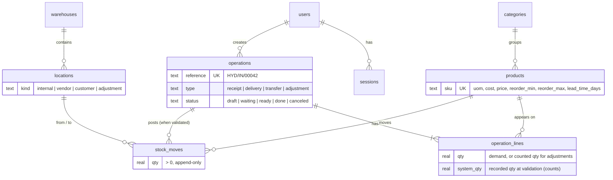

# Architecture

## Layers

```
src/ (React)            features/* pages, shared components, TanStack Query hooks
   │  fetch /api
server/routes/*         HTTP only: parse input with shared zod schemas, call a service, return JSON
server/services/*       business rules and transactions (operations, inventory, auth, dashboard, analytics)
server/repos/*          SQL only — no rules
server/db/*             schema, migrations policy, deterministic seed
shared/domain/*         pure TypeScript used by both sides: types, schemas, lifecycle, move planning,
                        availability, references, health score, reorder
```

## Data model



- **On-hand is a view** (`stock_quants`: Σ in − Σ out per product per location). No table stores a stock number.
- **Append-only ledger:** triggers reject UPDATE/DELETE on `stock_moves`, any update to a done operation, and edits to its lines.
- **Exactly one virtual location per kind** (partial unique index), so every receipt, delivery and count posts against the same counter-party.
- **Indexes** for the ledger's hot paths: (product, to/from location), (to/from location, created_at) for dashboard aggregates.

## Document lifecycle

```mermaid
stateDiagram-v2
  [*] --> Draft
  Draft --> Ready: confirm (stock available / receipts, counts)
  Draft --> Waiting: confirm (delivery or transfer short of stock)
  Waiting --> Ready: check availability
  Ready --> Waiting: check / failed validation (stock went elsewhere; picks reset)
  Draft --> Done: validate (receipts, transfers, counts)
  Ready --> Done: validate (deliveries: every line picked + packed)
  Draft --> Canceled
  Waiting --> Canceled
  Ready --> Canceled
  Done --> [*]
```



Validation is one database transaction: re-check availability against the live ledger → plan double-entry moves (pure function) → append → mark done. Any failure rolls back everything; a Ready document that failed for lack of stock is first moved back to Waiting in its own committed step, so its stored state never overstates readiness.

## Decisions worth knowing

| Decision | Why |
|---|---|
| `node:sqlite`, not an external database | Zero native build on Windows, single file, transactions and views are enough for one site |
| Derived stock, not counters | Every number is explainable and reconciles by construction; history cannot drift from totals |
| Seed generated by driving the real service with a simulated clock | Demo data obeys exactly the rules the app enforces; deterministic across resets |
| Server-Sent Events for "real-time" | One-way change notifications are all the UI needs; no socket infrastructure |
| Schema version bump rebuilds the demo database | The data is reproducible from the seed; documented rather than migrated in place |
| Chart shows value at cost, not units | Summing kg, metres and boxes is meaningless; value is the one comparable unit |
